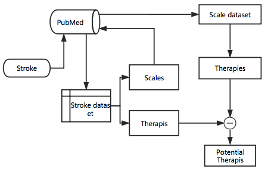

# Stroke-findings
We aim to find some potential physical treatments for stroke. There are two methods used in this project.

### Diseases-Scales-Therapies Network
The code are mainly included in directory DSTN.
main procedure is as follows:

### Cite Us

### Contact Us

    Guilin Meng（15216758879@163.com）
    Yong Huang (hyyc116@gmail.com)

